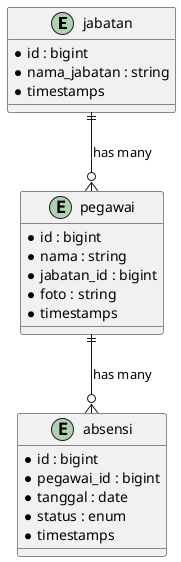

# Sistem Absensi BPN

Sistem Absensi BPN adalah aplikasi sederhana berbasis Laravel untuk mengelola data pegawai, jabatan, dan rekam absensi harian. Aplikasi ini menyediakan dashboard statistik sederhana, CRUD untuk jabatan, pegawai, dan absensi, serta tampilan yang responsif dengan template SB-Admin.

---

## Daftar Isi

-   [Tentang Aplikasi](#tentang-aplikasi)
-   [Fitur Utama](#fitur-utama)
-   [Peran Admin](#peran-admin)
-   [Requirements](#requirements)
-   [Instalasi & Setup](#instalasi--setup)
    -   [Clone repo](#clone-repo)
    -   [Konfigurasi environment](#konfigurasi-environment)
    -   [Install dependencies](#install-dependencies)
    -   [Migrasi & seeding](#migrasi--seeding)
    -   [Menjalankan aplikasi](#menjalankan-aplikasi)
-   [Cara Penggunaan (Admin)](#cara-penggunaan-admin)
-   [ERD / Struktur Database](#erd--struktur-database)
-   [Routes & API singkat](#routes--api-singkat)
-   [Catatan Tambahan](#catatan-tambahan)
-   [Kontribusi & Lisensi](#kontribusi--lisensi)

---

## Tentang Aplikasi

Sistem Absensi BPN dirancang untuk membantu admin mengelola data jabatan, pegawai, serta mencatat kehadiran (absensi) harian. Aplikasi ini berbasis Laravel 10 dan menggunakan Vite untuk tooling frontend.

## Fitur Utama

-   Autentikasi pengguna (login/logout).
-   Dashboard menampilkan statistik dan ringkasan absensi.
-   CRUD Jabatan (position).
-   CRUD Pegawai (employee) beserta foto profil.
-   CRUD Absensi (tanggal & status: Hadir / Izin / Sakit / Alpha).
-   Upload dan pengelolaan file foto pegawai.

## Peran Admin

Admin adalah pengguna yang memiliki akses ke seluruh fitur aplikasi (dashboard, CRUD jabatan, pegawai, dan absensi). Tugas admin meliputi:

-   Menambahkan/ubah/hapus data Jabatan.
-   Menambahkan/ubah/hapus data Pegawai beserta foto.
-   Mencatat, mengubah, atau menghapus data absensi per pegawai.
-   Memantau laporan & statistik absensi harian di dashboard.

> Catatan: Saat ini aplikasi tidak menerapkan sistem peran (role/permissions) yang kompleks, jadi setiap user yang memiliki akun dapat mengakses fitur admin jika sudah login.

## Requirements

-   PHP >= 8.1
-   Composer
-   Node.js (v16+) dan NPM
-   MySQL / MariaDB (bisa juga gunakan DB lain jika disesuaikan di `.env`)
-   Git (untuk clone)

## Instalasi & Setup

Berikut langkah-langkah menjalankan project secara lokal (Windows PowerShell):

### Clone repo

```powershell
git clone https://github.com/lexyy36/web-atrbpnbran.git
cd web-atrbpnbran
```

### Konfigurasi environment

1. Salin file `.env.example` menjadi `.env`:

```powershell
copy .env.example .env
```

2. Buka `.env` dan sesuaikan konfigurasi database (DB_DATABASE, DB_USERNAME, DB_PASSWORD), APP_URL, dan pengaturan lain jika diperlukan.

3. Buat database di MySQL (contoh):

```sql
CREATE DATABASE web_atrbpnbran;
```

### Install dependencies

```powershell
composer install
npm install
```

### Generate application key

```powershell
php artisan key:generate
```

### Migrate dan Seed (opsional)

```powershell
php artisan migrate
php artisan db:seed
```

Jika belum ada seeder khusus untuk membuat user admin, anda bisa membuat user lewat tinker:

```powershell
php artisan tinker
>>> use App\Models\User;
>>> User::create(['name' => 'Admin', 'email' => 'admin@example.com', 'password' => bcrypt('password')]);
>>> exit
```

### Storage link (file upload)

```powershell
php artisan storage:link
```

### Menjalankan aplikasi

Untuk development:

```powershell
npm run dev
php artisan serve --host=127.0.0.1 --port=8000
```

Kemudian buka `http://127.0.0.1:8000` di browser.

---

## Cara Penggunaan (Admin)

1. Login menggunakan akun yang sudah dibuat (mis. `admin@example.com`).
2. Mengelola Jabatan: Menu > Jabatan > Tambah / Edit / Hapus.
3. Mengelola Pegawai: Menu > Pegawai > Tambah (upload foto) / Edit / Hapus.
4. Mengelola Absensi: Menu > Absensi > Tambah catatan kehadiran pegawai (pilih pegawai, tanggal, dan status).
5. Di Dashboard admin, Anda melihat ringkasan: total pegawai, jumlah kehadiran harian, dan grafik distribusi absensi.

Catatan: Status absensi pada database disimpan dengan nilai enum: `hadir`, `izin`, `sakit`, `alpha`.

## ERD / Struktur Database

Berikut adalah ringkasan tabel dan relasi utama:

Tables:

-   `users`: id, name, email, password, timestamps
-   `jabatan`: id, nama_jabatan, timestamps
-   `pegawai`: id, nama, jabatan_id (FK), foto, timestamps
-   `absensi`: id, pegawai_id (FK), tanggal, status, timestamps

Relasi:

-   Jabatan 1 -- n Pegawai
-   Pegawai 1 -- n Absensi

ASCII ERD:

```
Jabatan
  id
  nama_jabatan
  timestamps

Pegawai
  id
  nama
  jabatan_id -> jabatan.id
  foto
  timestamps

Absensi
  id
  pegawai_id -> pegawai.id
  tanggal
  status (hadir/izin/sakit/alpha)
  timestamps
```

PlantUML (opsional - dapat digunakan untuk menghasilkan gambar ERD):



## Routes & API singkat

-   Login: `GET /login`, `POST /login`
-   Logout: `POST /logout`
-   Dashboard: `GET /` (requires auth)
-   Resource routes (CRUD untuk admin, memerlukan auth):
    -   `jabatan`: `/jabatan` (index, create, store, edit, update, destroy)
    -   `pegawai`: `/pegawai` (index, create, store, edit, update, destroy)
    -   `absensi`: `/absensi` (index, create, store, edit, update, destroy)

## Troubleshooting & Tips

-   Jika `php artisan migrate` gagal, pastikan database terbuat dan `.env` sudah benar.
-   Jika tidak ada user untuk login: gunakan `php artisan tinker` untuk membuat user admin (lihat langkah di atas).
-   Hapus cache config jika environment tidak terbaca: `php artisan config:clear`.
-   Jika Anda menggunakan port lain untuk `artisan serve`, sesuaikan `APP_URL` di `.env`.

## Kontribusi & Lisensi

Kontribusi perbaikan atau fitur diterima dengan mengirimkan PR ke repository ini.

Lisensi: MIT.

---

Jika butuh dokumentasi tambahan (contoh export CSV, fitur laporan, atau UI baru), beri tahu saya fitur mana yang ingin ditambahkan dan saya bantu sediakan dokumentasi & langkah implementasinya.
